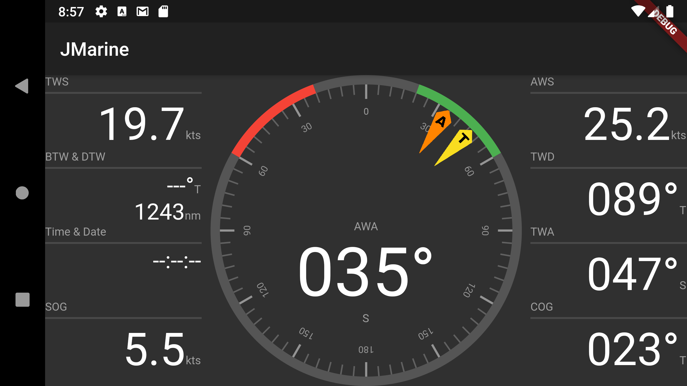

# jmarine

JMarine - Display NMEA0183 data

## Overview

This application connects to an NMEA0183 source and displays a set of sailing-relevant information.
It is written using Flutter, and thus runs on all Flutter-supported platforms (iOS, Android, Linux, Mac, Windows, web).  
However, my testing to date is only Android and iOS.

##Disclaimer
This is offered entirely for demonstration & experimentation purposes only, and should not under any circumstances be used for navigation. It is not intended to be substitute or replacement any such system.
